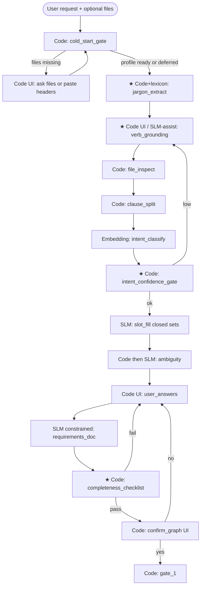

# Foolproofing Requirements Capture (Jargon-Heavy Asks)

**Status:** Design — not implemented.  
**Related:** [TECH_DEBT.md](../TECH_DEBT.md) #5 (multi-backend BA), #10 (task packets), #11 (Code control plane).  
**Problem example:** `"I want to do sales reconciliation every month end"` — underspecified jargon + schedule, often no files yet.

**Definition of “foolproof” here:** The system must not silently invent a wrong pipeline. It may block, ask, or escalate — but must not advance past confirmation with unresolved business meaning, unbound columns/files, or ungated artifacts.

This is **fool-resistant by construction**, not mathematically certain (users can still click the wrong MCQ). Residual risk is acknowledged in §7.

---

## 1. Why the current 6-step BA is not enough

| Gap | Effect on jargon ask |
|-----|----------------------|
| No dedicated **dejargon / verb-definition** step | “Reconciliation” never gets an explicit meaning |
| **File Inspector** assumes data present | Cold start (request-only) has empty closed sets |
| **Intent** is one of ~8 labels | May map to weak `join` / `multi-step` without the real multi-op story |
| **Slot fill** only picks from profile columns | Cannot invent process steps the user didn’t ground |
| **Ambiguity** is column-similarity only | Does not catch “wrong business process” |
| **User Answers** MCQs may omit “what does X mean?” | If templates lack that slot, jargon slips through |
| **Requirements Doc** trusts filled slots | Faithfully encodes mistakes |
| **confirm_graph** helps only if the draft shows the misunderstanding clearly | User may rubber-stamp a pretty wrong graph |

---

## 2. What’s needed for foolproofing

### 2.1 Non-negotiable product rules (Code)

1. **No advance on open questions** — `ba_questions` / slot gaps non-empty ⇒ cannot leave requirements stage.  
2. **No confirm without checklist pass** — Code runs a *requirements completeness checklist* before offering `confirm_graph`.  
3. **No Separator until `confirm_graph(True)`** — already #11.  
4. **Cold-start path** — if no usable inbox/reference files, enter **elicitation mode** (ask for files or paste headers) before slot fill.  
5. **Verb grounding required** — every domain verb in the request (reconcile, roll up, settle, …) must map to a **canonical operation chain** chosen or confirmed by the user.  
6. **Schedule grounding** — phrases like “month end” must become an explicit trigger slot (cron / rule + timezone note), never assumed.  
7. **Escalation with consent** — after N failed local attempts or low intent confidence, offer cloud help on a **domain-stripped** summary only.

### 2.2 Completeness checklist (Code, before confirm)

Block confirmation unless all are true:

| Check | Example failure |
|-------|-----------------|
| ≥1 data source with role + retrieval | “Sales” with no file/API |
| Every source has fields **or** explicit “user will supply headers later” flag | Empty fields |
| Every domain verb → confirmed op chain | “reconcile” unbound |
| Join/match keys selected from closed sets **or** marked TBD with user ack | Hallucinated `SKU` |
| Output fields listed | No “what do I get?” |
| Trigger filled (schedule and/or inbox) | “month end” ignored |
| No `unknown` / `tbd` left without user ack | Silent TBDs |

---

## 3. Additional steps (proposed BA pipeline)

Extend the 6-step BA into a **grounded requirements pipeline**. New steps marked ★.

### Step catalog

| ID | Name | Backend | Purpose |
|----|------|---------|---------|
| C0 | Cold-start gate | **Code** | Decide: profile now vs elicit files/headers vs proceed with deferred binding |
| ★ D0 | Jargon extract | **Code** (+ optional small lexicon) | Pull candidate domain terms/verbs/acronyms from request (NER-lite / glossary match / noun chunks) |
| ★ D1 | Verb grounding | **Code UI** primary; SLM may *propose* options only | For each verb, user picks a **canonical chain** from a fixed menu (e.g. reconcile → `join + diff` \| `join + flag` \| `multi-step custom…`) |
| S0 | File inspect | **Code** | Profile CSVs when present |
| S0b | Clause split | **Code** | Preserve order of multi-intent clauses |
| S1 | Intent classify | **Embedding** | Map to canonical intent(s) per clause |
| ★ S1b | Intent confidence gate | **Code** | If score &lt; threshold → force D1 / more questions; never silent continue |
| S2 | Slot fill | **LocalLLM** constrained | Fill intent templates from closed sets |
| S3 | Ambiguity | **Code → LocalLLM** | Column ties; not business meaning |
| S4 | User answers | **Code UI** | MCQs + samples; merges into slot dict |
| S5 | Requirements doc | **LocalLLM** constrained | Emit schema-valid requirements / graph draft |
| ★ CL | Completeness checklist | **Code** | Block confirm on gaps |
| CF | Confirm | **Code** | Only path to `owner_confirmed` |
| — | Escalation | **Code UI** → optional **Cloud** | User consent; domain-stripped packet only |

---

## 4. Risks by new step: SLM vs Code-only

| Step | If Code-only | If SLM-owned | Recommendation |
|------|--------------|--------------|----------------|
| **C0 Cold-start** | Clear; may feel strict | SLM invents fake files/columns | **Code only** |
| **D0 Jargon extract** | May miss slang not in lexicon | May over-extract / invent terms | **Code + lexicon**; SLM optional second pass with human review of term list |
| **D1 Verb grounding** | Menu may lack user’s true process | SLM picks chain without asking → silent wrong pipeline | **Code UI required**; SLM may rank menu options only |
| **S1b Confidence gate** | Threshold tuning / false blocks | Asking SLM “are you sure?” is useless | **Code only** |
| **CL Completeness** | Brittle if required fields wrong | SLM “looks complete” theater | **Code only** |
| **S2 / S5** (existing) | Templates can’t handle open language | Hallucinated JSON / columns | Keep **SLM + grammar constraints**; never unconstrained |
| **Escalation summary** | Hard to compress nuance in rules | Cloud sees business detail if not stripped | **Code redacts** → optional Cloud on generics |

**Do not add an SLM “orchestrator”** that decides whether to skip D1/CL/CF.

---

## 5. Do we need a cloud LLM?

| Use | Cloud needed? | Why |
|-----|---------------|-----|
| Control plane / confirm / gates / checklist / cold-start | **No** | Must stay Code (#11) |
| Verb grounding menu selection | **No** | User + Code UI |
| Slot fill / requirements JSON (typical ETL) | **No** if constrained LocalLLM works | Prefer local for privacy |
| Unusual jargon / novel process after local fails | **Optional** | Escalation with consent; send **domain-stripped** paraphrase + generic ops, not raw column names if avoidable |
| Atom **creation** (phase 5) | **Yes (recommended)** | Reliable generic codegen; business mapping already firewalled |
| Default path for “sales reconciliation” | **No** | Should succeed via D1 menus + files + confirm |

**Policy:** Cloud is an **escape hatch and atom forge**, not the primary requirements brain. Local-first remains the privacy story in TECH_DEBT #5.

---

## 6. Additional tech required

| Tech | Need | Role |
|------|------|------|
| **Task packets / TaskSpec** (#10) | Required | One card per step (D0, D1, S2, …) |
| **Code control plane** (#11) | Required (done) | Advance/retry/confirm |
| **JSON Schema / grammar decode** (Outlines, SGLang, llama.cpp grammars) | Required for S2/S5 | Stop invalid artifacts |
| **Embeddings** (e.g. bge-small) | Required for S1 | Intent + column shortlist |
| **DuckDB or Polars** | Required for S0 | Profiles / samples for MCQs |
| **Canonical intent + verb-chain catalog** (versioned YAML) | Required for D1/S1 | Product content, not just models |
| **Lexicon / glossary** (domain terms → questions) | Recommended for D0 | Improves jargon hit rate without cloud |
| **Local LLM runtime** (Ollama / llama.cpp) | Required for local S2/S5 | Privacy path |
| **Cloud API** (Claude/GPT) | Optional for escalate + atom create | Consent-gated |
| **UI for MCQs** (CLI prompts → later TUI/web) | Required for D1/S4/CF | Code channel |
| **Eval harness** | Required for “foolproof” claims | Golden jargon prompts; assert block vs wrong advance |

No need for: agent frameworks that own the state machine, multi-agent debate for confirmation, or unconstrained “chat until done.”

---

## 7. Worked example: “sales reconciliation every month end”

| Stage | Expected behavior |
|-------|-------------------|
| C0 | No files → ask to drop sales + reference CSVs or paste headers |
| D0 | Extracts: sales, reconciliation, month end |
| D1 | User picks e.g. `join two files on key → compute difference → flag exceptions` |
| S0–S2 | Columns from profile; slots: left/right file, key, amount fields |
| S1b | If intent score low, return to D1 |
| S4 | Confirm keys with samples; set trigger `0 18 L * *` or “last business day” note |
| CL | Fails until key + outputs + trigger filled |
| CF | User sees plain-language chain + sources; yes → gate_1 |
| Escalate | Only if user cannot pick a chain / local slot fill fails 3× — cloud gets generic ops, not necessarily raw PII columns |

Wrong path we must prevent: Intent→`join` → SLM invents columns → Requirements JSON → user clicks Yes without understanding.

---

## 8. Residual risk (honesty)

Even with this design:

- User can affirm a wrong verb chain.  
- Catalog may lack a rare process (must escalate or add catalog entry).  
- “Month end” calendars differ by locale — may need a follow-up slot.  
- Garbage-in headers ⇒ garbage closed sets.

**Foolproof = no silent wrong advance**, not **perfect business understanding**.

---

## 9. Implementation sequence (suggested)

1. Catalog: canonical intents + **verb → op-chain** menu (content).  
2. Code: C0, D0 (lexicon), D1 UI, S1b, CL — wire into #11 task ids.  
3. #10 packets for each new step.  
4. Constrained LocalLLM for S2/S5.  
5. Eval set of jargon prompts (including reconciliation, rollup, settle).  
6. Optional cloud escalation + keep atom create on cloud.

---

## 10. Summary

| Question | Answer |
|----------|--------|
| What’s needed? | Verb grounding, cold-start, confidence gate, completeness checklist, confirm — all Code-enforced |
| Extra steps? | Yes: C0, D0, D1, S1b, CL |
| SLM on those? | No for gates/checklists/cold-start/confirm; SLM only proposes, never decides |
| Cloud LLM? | Optional escalation + recommended for atom create; not required for default jargon path |
| Extra tech? | Embeddings, profiles (DuckDB/Polars), grammar decode, verb-chain catalog, eval harness — not a new orchestrator agent |
