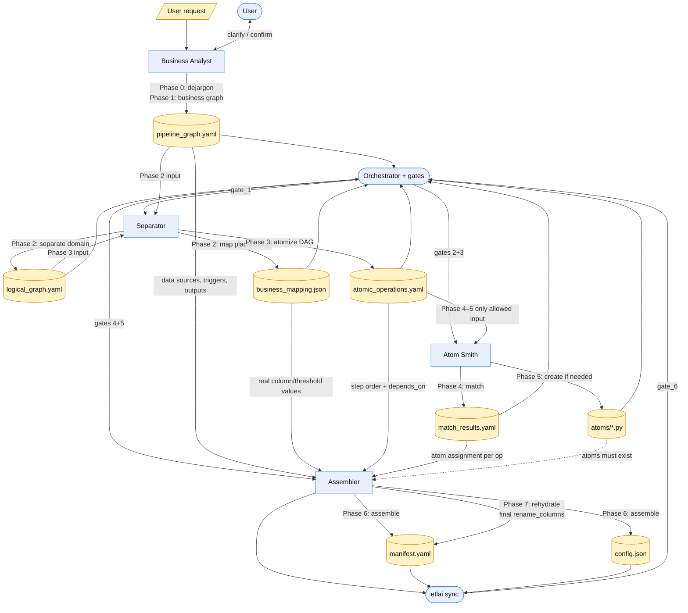
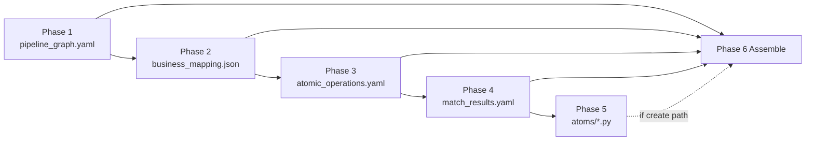

# Pipeline Creation — Phase Dependency Graph

Artifact-centric dependency view of the 7-phase workflow (plus Phase 0).
Phases run **sequentially** for control/gates, but Phase 6 **reads artifacts from
multiple earlier phases** — not only its immediate predecessor.

## Phase summary

| Phase | Does | Actor | Creates | Passes to |
|------:|------|-------|---------|-----------|
| 0 | Expand jargon, clarify request | Business Analyst (+ User) | Partial `pipeline_graph.yaml` | Phase 1 |
| 1 | Complete business process graph; user confirms | Business Analyst (+ User) | `pipeline_graph.yaml` (`owner_confirmed: true`) | Phase 2; later Phase 6 |
| 2 | Strip domain terms; split logic vs mapping | Separator | `logical_graph.yaml`, `business_mapping.json` | Phase 3 (`logical_graph`); Phase 6 (`business_mapping`) |
| 3 | Split into single-verb DAG ops | Separator | `atomic_operations.yaml` | Phase 4; Phase 6 |
| 4 | Match ops to shipped/custom atoms | Atom Smith | `match_results.yaml` | Phase 5 (unmatched); Phase 6 |
| 5 | Write new generic atoms (if needed) | Atom Smith | `atoms/<name>.py` (+ tests) | Phase 6 (runtime resolution) |
| 6 | Wire steps, inputs, triggers; translate placeholders → real config | Assembler | `manifest.yaml`, `config.json` | Phase 7; `etlai sync` / gate 6 |
| 7 | Ensure final `rename_columns` rehydration | Assembler | Updates final step in manifest + config mapping | Runnable pipeline |

## Artifact dependency edges (what Phase 6 actually reads)

## Is Phase 6 dependent on Phase 2 or Phase 1?

**Both — directly.**

- **Phase 1** → `pipeline_graph.yaml` (inputs/roles, triggers, outputs)
- **Phase 2** → `business_mapping.json` (placeholder → real column/threshold/source values)

Phase 6 also needs Phase 3 (`atomic_operations.yaml`) and Phase 4 (`match_results.yaml`).
Sequential control flow is 1→2→3→4→5→6, but the Assembler’s data dependencies fan in from 1, 2, 3, and 4 (and 5 when new atoms were created).

## Notes

- Phases 0–1 loop with the user; Phases 2–7 do not.
- Atom Smith is firewalled from `business_mapping.json` and `pipeline_graph.yaml`.
- Intermediate workflow artifacts live under `pipelines/<name>/workflow/`.
- Final runnable artifacts live under `pipelines/<name>/` (`manifest.yaml`, `config.json`).
