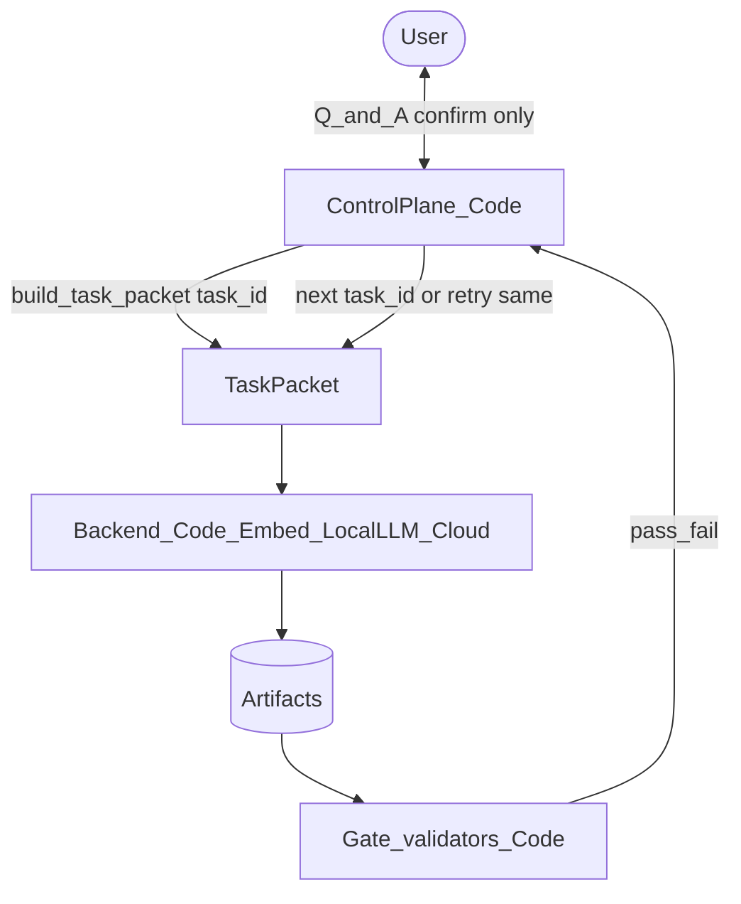

# Layer Contracts — Phase / Role / Control Plane

**Rule:** phases = *what*; roles = *access policy*; **control plane = Code** (*when / who talks to user / gates*).  
Do **not** merge these into one prose blob. Compose at runtime for each invoke (required for small local models).

## Layers

| Layer | Lives in | Owns | Must NOT contain |
|-------|----------|------|------------------|
| **Phase (task)** | `workflow/phase_N_*.md` + `templates/` | Inputs, outputs, process, done-when, DO/DON'T, schema | Agent names, user-session ownership, spawn/retry/firewall policy |
| **Role (optional packaging)** | `agents/*_SYSTEM_PROMPT.md` | Readable/writable paths, firewall boundaries, which phase cards to run | Restated phase process, confirmation loops, gate orchestration |
| **Control plane** | **`etlai/orchestrator.py`** (→ `TaskRouter`, TECH_DEBT #10 / #11) | User channel, turn assembly, `confirm_graph`, gates, retries, firewall, next `task_id` | Domain answers, atom code, business mapping; **not** an LLM state machine |

**Hierarchy (source of truth → payloads → shims):**

1. **Source of truth:** `etlai/orchestrator.py` (+ future `TaskSpec` / `TaskRouter` from TECH_DEBT #10)
2. **Worker payloads:** phase cards + templates (+ allowlists)
3. **Transitional drivers only:** `ORCHESTRATION.md` / `ORCHESTRATOR_SYSTEM_PROMPT.md` — call the Python APIs; do **not** *be* the state machine

Markdown is **not** a peer of code for control. It is a Claude Code / human shim until `etlai create` fully owns the loop.

## Runtime composition



Each worker invoke receives a **packet** built by **Code** (not by an LLM orchestrator):

1. Thin role/allowlist overlay (optional)
2. Exactly one phase (or sub-step) playbook
3. Schema/template for the artifact
4. Concrete paths + prior-turn inputs

```
Code control plane (TaskRouter / Orchestrator)
  → TaskPacket: [allowlist] + [phase_N playbook] + [template] + [paths/inputs]
  → worker backend (Code | Embedding | LocalLLM | Cloud)
  → artifact
  → gate (Code)
  → Code picks next task_id or retries same
```

| Concern | Who | Why |
|---------|-----|-----|
| Next `task_id`, loops, max retries | **Code** (`orchestrator.py` → `TaskRouter`) | Small LLMs fail at state machines |
| Build packet (one playbook + paths + inputs) | **Code** `build_task_packet` | Must be exact; no “also attach phase 1” drift |
| User channel / `confirm_graph` | **Code** (+ CLI/UI) | Confirmation is a contract, not model judgment |
| Gates / firewall | **Code** | Already deterministic; keep it so |
| Fill slots / separate terms / write atom | **LocalLLM or Cloud** as *worker on one packet* | Narrow, constrained I/O |

**Control plane backend is always `CodeBackend`.** Never LocalLLM for phase advance, confirmation, gates, firewall, or packet assembly. LocalLLM/Cloud run **workers** only. See TECH_DEBT #11 (done) and #10 (packets).

If any LLM is ever used in the control path, constrain it to a tiny optional helper (e.g. pick among fixed next-actions) with Code validating the choice — never free-form phase routing.

## Phase playbook shape (canonical)

Every `phase_N_*.md` should use only:

- Purpose  
- Input (artifacts / data)  
- Output (artifacts)  
- Process (numbered, mechanical)  
- Done When  
- DO / DO NOT  
- Examples (optional)  
- Gate Validator (which script; structural only)  

Neutral language: refer to **artifacts** (`pipeline_graph.yaml`, `ba_questions.json`), not agents.  
If user answers are needed, say “answered questions provided as input this turn” — not “ask the user” or “Orchestrator relays.”

## Role prompt shape (canonical)

Every worker `*_SYSTEM_PROMPT.md` should use only:

- Role one-liner  
- Phases assigned (by number/name — pointer only)  
- Allowed reads / writes  
- Forbidden access (firewall)  
- Exit: write artifacts and stop (control plane runs gates)  

Point to phase playbooks for *how*. Do not duplicate process steps.

## Control plane shape

Control plane is **deterministic Python** (`etlai/orchestrator.py`, future `TaskRouter`):

- Mediation of clarifying questions and confirmation (`confirm_graph`)
- Assembling turn packets from the tables above
- Gate run + retry
- Firewall activate/deactivate around Atom Smith phases
- Advancing `task_id` (never delegated to a free-form LLM)

`ORCHESTRATION.md` / orchestrator system prompts are shims for coding assistants until the CLI owns this loop (TECH_DEBT #11 → #6).

## Why this exists

Strong cloud agents can absorb entangled markdown. Small local models need **one invoke = one task card**. Entanglement blocks the multi-backend split (TECH_DEBT #5). “Local LLM orchestration” means **workers** are local — not that a local LLM owns the pipeline-creation state machine.
